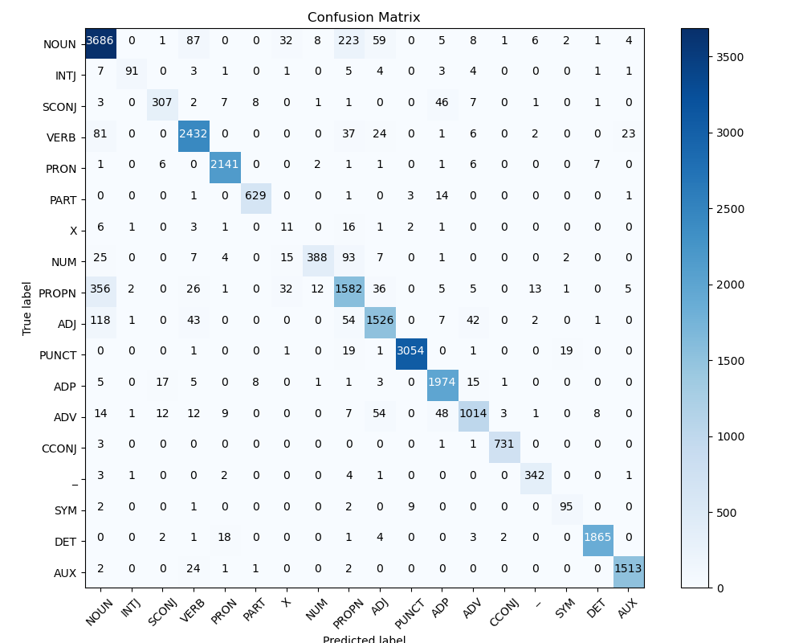

# NLPlib

NLPlib is a Python library that provides basic NLP tools and models including:

- **Essay Score Prediction:** Estimates an essay score using a basic statistical method.
- **POS Tagging:** Tags each word in a sentence with its part of speech using a pre-trained model.
- **N-Gram Language Modeling:** Builds language models based on n-gram probabilities.
- **Word Segmentation:** Breaks down continuous text into individual words.
- **Text Search:** Searches text using word embeddings.

## Installation

Clone the repository and install the package in editable mode:

```
pip install -e .
```

## Usage

The library provides several modules for natural language processing tasks. 
Here are brief examples of each module. For complete examples, see the [examples](examples/) directory.

### N-Gram Model

```python
from NLPlib import n_gram_model

sentences = [
    ('this', 'is', 'a', 'sentence'),
    ('another', 'example', 'sentence'),
]
model = n_gram_model.NGramModel(n=2, k=1.0, sentences=sentences)
# Calculate probability of 'sentence' given 'example'
prob = model.p('sentence', ('example',))
print(f"Probability: {prob}")
# Score the full sentence
score = model.score(('this', 'is', 'a', 'sentence'))
print(f"Log probability score: {score}")
```

### Essay Score Prediction

```python
from NLPlib import essay_score_prediction

# Simple feature extraction
essay = "Your essay text goes here."
length_score = essay_score_prediction.EssayScorePredictorBase.calculate_length_4th_root(essay)
ovix_score = essay_score_prediction.EssayScorePredictorBase.calculate_ovix(essay)
print("Essay Length (4th root):", length_score)
print("OVIX score:", ovix_score)

# For a complete prediction model, you would need training data:
# Using scikit-learn based predictor
predictor = essay_score_prediction.EssayScorePredictorSKLearn(learning_rate=0.1, epochs=100)
# After training with data, you could predict:
# score = predictor.predict(essay)
# print("Predicted Essay Score:", score)
```

### Part-of-Speech Tagging

```python
from NLPlib import POS_tagger

# Initialize the POS tagger with default hyperparameters
pos_tagger = POS_tagger.POSTagger()

# Provide a sentence for tagging
sentence = "This is a test sentence."
tags = pos_tagger.predict_sentence(sentence)
print("POS Tags:", tags)
```

### Word Segmentation

```python
from NLPlib import word_segmenter

# Create a segmenter with a lexicon file
# The lexicon file should be a JSON dictionary with word frequencies
segmenter = word_segmenter.WordSegmenter('path_to_lexicon.json')

# Segment a text with no spaces
text = "wordsegmenterexample"
segments = segmenter.segment(text)
print("Segments:", segments)
```

### Text Search

```python
from NLPlib import text_search

# Simple text search
documents = [
    "This is the first document.",
    "This document is the second document.",
    "And this is the third one.",
]
results = text_search.search("document", documents)
print("Search Results:", results)

# For more advanced semantic search using embeddings:
# word_vector_files = ['path_to_embeddings.en.gz']
# search_engine = text_search.TextSearch(word_vector_files)
# search_engine.index_text('path_to_text.gz', 'en')
# results = search_engine.search(['document'], 'en', n_matches=2)
```

## Examples

For more detailed examples showing how to use each module, see the [examples](examples/) directory:

- **ngram_model_example.py**: Working with language models
- **essay_scoring_example.py**: Training and using essay scoring models
- **pos_tagging_example.py**: Part-of-speech tagging with pre-trained models
- **word_segmentation_example.py**: Segmenting continuous text into words
- **text_search_example.py**: Basic and advanced text search functionality

## Running Tests

All modules include unit tests. To run the tests, execute the following command from the root of the project:

```
python -m unittest discover -s tests
```

This command will automatically discover and run tests in the `tests` directory.

## Modules Overview

- **N-Gram Model:** Constructs language models using n-gram probabilities. Useful for predictive text and analysis.
- **Essay Score Prediction:** Computes a score for essays based on text length and other features.
- **POS Tagging:** Uses a pre-trained model (provided as a `.h5` file in the `models/` directory) to assign part-of-speech tags. The accompanying confusion matrix (see below) illustrates its performance.
- **Word Segmentation:** Segments continuous text into individual words.
- **Text Search:** Implements search functionality based on word embeddings.

### Confusion Matrix Example

Below is an example confusion matrix for the English vocabulary of the POS tagger:



## Word Embeddings

The advanced text search example requires word embedding files. These are not included with the package. Download the embeddings and adjust the paths in the example code as needed.